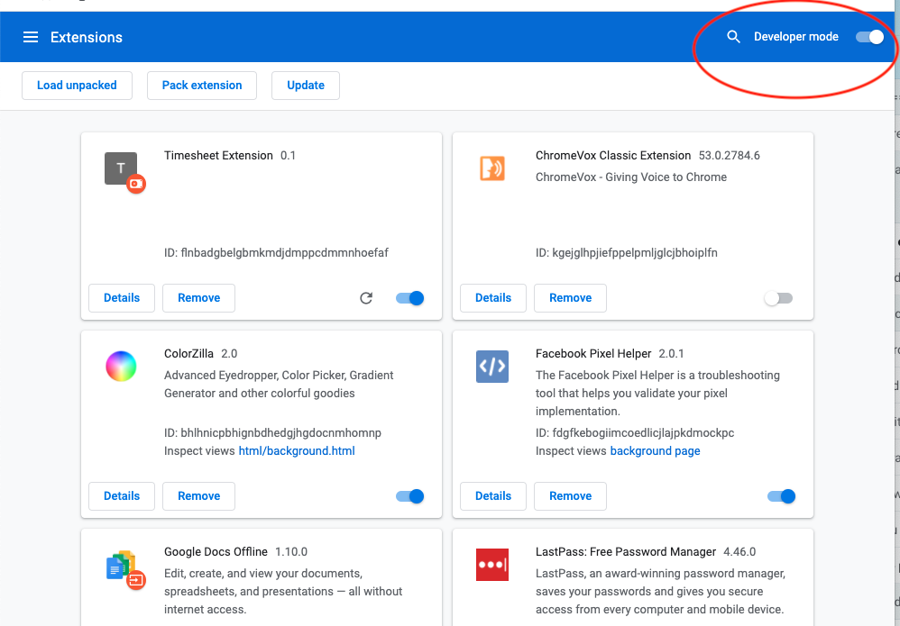
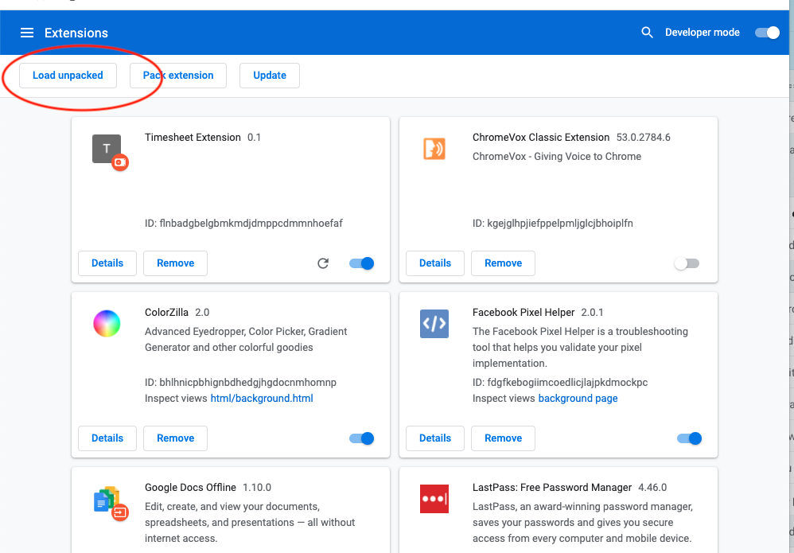
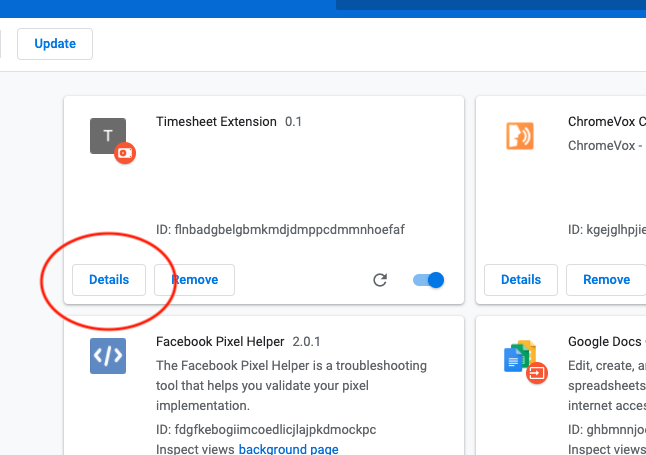
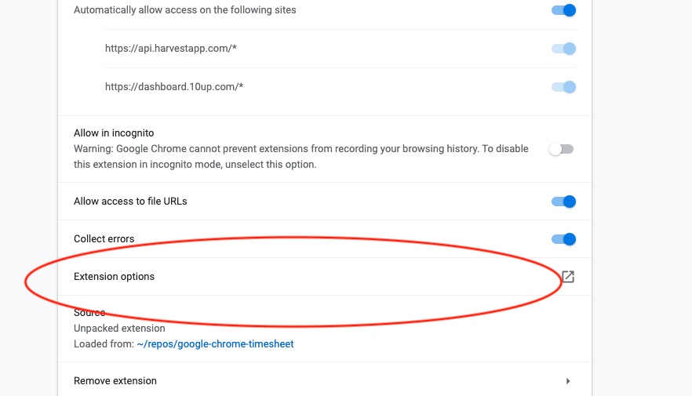
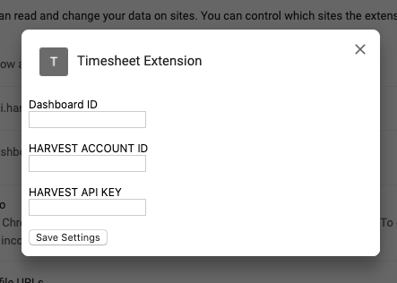
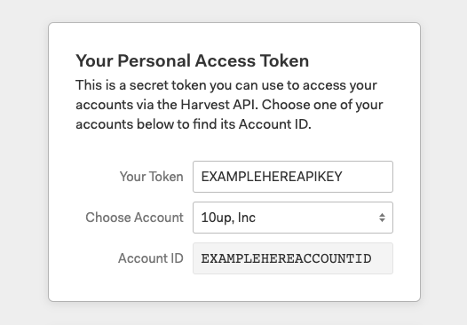
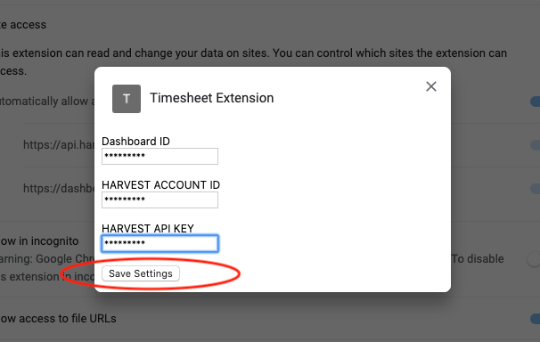
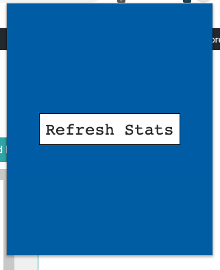
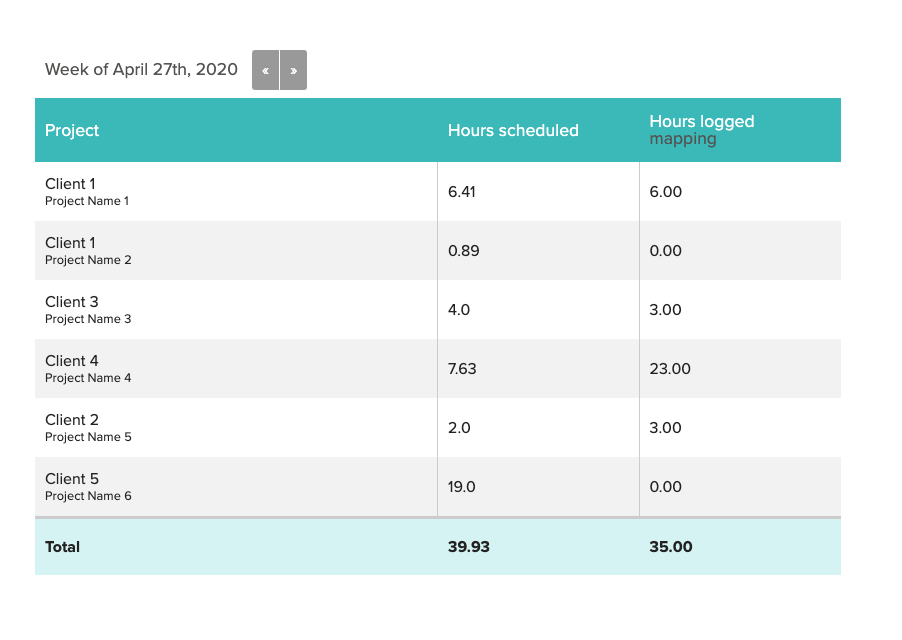
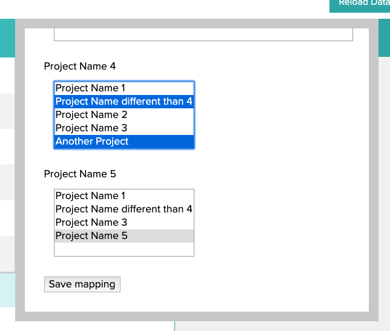

# Check 10up resourcing against time logged
This is a concept tool to check 10up resourcing and time logged in Harvest

## Installation from Chrome Web Store [skip Manual installation if using this step]: ##
https://chrome.google.com/webstore/detail/timesheet-extension/hhelbiolpfjfepihdklgojjhpkgbmfjp?hl=en-US
- - - - 
## Manual installation: ##
* Download extension from here: https://github.com/eflorea/google-chrome-timesheet/archive/master.zip and unzip it locally.
* Turn Developer mode On in Google Chrome: Preferences -> Extensions -> Developer Mode = ON

* Add the extension to Google Chrome: Preferences -> Extensions -> Load unpacked -> choose the unziped folder of the extension

* You should see the extension in the list of Extensions (Timesheet Extension) now and an icon would appear on top right. 

- - - -

## Configuration ##
* Configure extension options
    * Extensions -> find Timesheet Extension and click on Details:
    
    * Find and click on Extension Options button:
    
    * You need to set Dashboard ID, Harvest Account ID and Harvest API Key:
    
 
* Getting Dashboard ID:
    * Go to 10up schedule to see your resourcing, the url should looks something like XXX.10up.com/blog/10upper/MYDASHBOARDID/ - copy MYDASHBOARDID into the Dashboard ID field in the extension options screen.
* Getting Harvest Account ID and Harvest API Key:
    * Go to Harvest developers page: https://id.getharvest.com/developers, create new API Token and copy Account ID and Your Token in the proper fields into the extension options screen.

* Save your extension options after you have all the data in.

- - - -

## Usage: ##
* Click on the extension icon on the top right  - this will open your resourcing page if you are not there already
* Click on Refresh Stats and a new column with hours logged will show up (if you already did this once - it will refresh the data for that week).

* If project names don't match with Harvest you will have to map them by clicking on __mapping__ link and save mapping. NOTE: the mapping needs to be run for each week, also if you don't see a specific project that means no time was logged in Harvest for that project:

- - - -

## Good luck and submit your timesheet on time! ##
